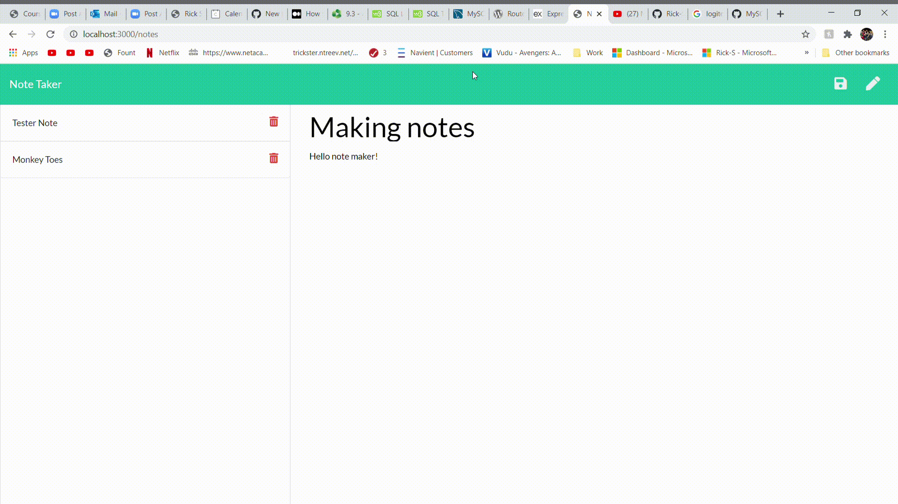

# Title: **Note-Taker-App**

&nbsp;
&nbsp;

## Description:

**This app runs allows you to create, store, and delete notes using the api and html routes.**

&nbsp;
&nbsp;

## Installation:

_Express and uuid are the npm packages you'll need to install_

&nbsp;
&nbsp;

## Contributors:

**none**

&nbsp;
&nbsp;

## Test:

**you can test this porject by creating an instance of the express server named app.js then going to localhost:3000/ in your browser. From there you can test the functionallity of the project.**

&nbsp;
&nbsp;

## License:

ISC

&nbsp;
&nbsp;

## License URL:

https://github.com/Rick-Smart/Note-Taker-App/issues

&nbsp;
&nbsp;

## GitHub UserName:

@Rick-Smart

&nbsp;
&nbsp;

## Email:

**rck-s@hotmail.com**

&nbsp;
&nbsp;

# Screen Shots

&nbsp;
&nbsp;

&nbsp;
&nbsp;

&nbsp;
&nbsp;

&nbsp;
&nbsp;

# Video Clip

&nbsp;
&nbsp;

